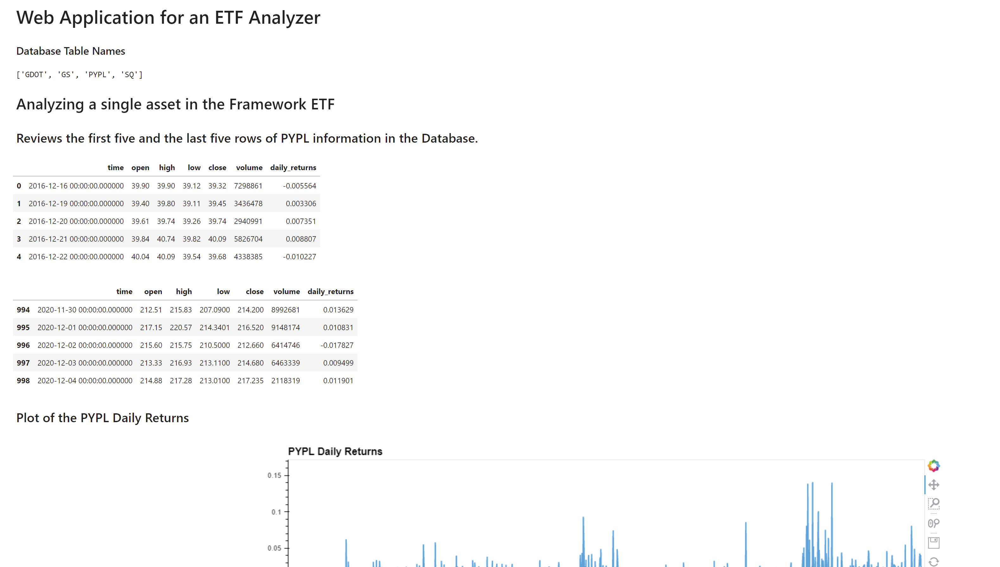
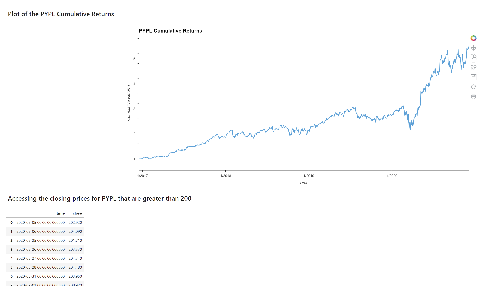
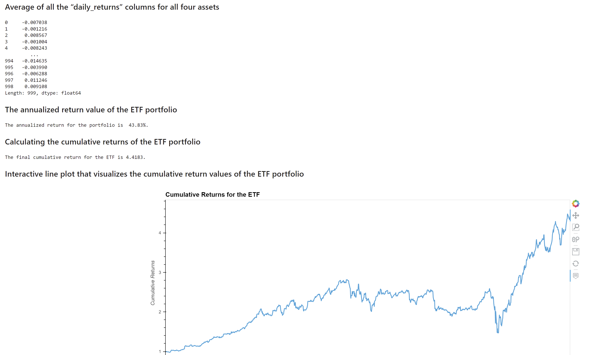

# Web Application for an ETF Analyzer

This is a Jupyter notebook that will build a financial database and web application by using SQL, Python, and the Voilà library to analyze the performance of a hypothetical fintech ETF. Though the ETF is hypothetical, a real one can just as easily be substituted in to the database allowing the analysis to be run on that one instead. This framework will allow the company to analyze ETFs for potential distribution to the clientele. This notebook will be viewable via Voila webpage, as listed below.

---

## Technologies

This project utilizes a lot of different add ons, please make sure you have all these and they are up to date:

* [JupyterLab 3.4.4](https://jupyter.org/) - For the notebook creation and running of the code.

* [pandas 1.4.3](https://github.com/pandas-dev/pandas/blob/main/README.md) - For reading the csv files and other operations.

* [numpy](https://https://numpy.org/) - Loaded in, not used in the framework, but could be used in future editions.

* [hvplot v0.8.0](https://github.com/holoviz/hvplot#readme) - For creating interactive and more detailed plots.

* [sqlalchemy v1.4.32](https://github.com/sqlalchemy/sqlalchemy) - For running SQL operations for the database.

* [voila v0.2.16](https://github.com/voila-dashboards/voila) - For viewing the information on a webpage.

---

## Installation Guide

If SQLAlchemy or Voila need to be installed, please run these commands below.

```python

    pip install SQLAlchemy

    conda install -c conda-forge voila
  
```

---

## Usage

This notebook will be viewed via Voila webpage. Please run the following code in your terminal after navigating to the folder with the notebook.

```python

   voila etf_analyzer.ipynb
  
```

Here are a few pictures of what you can expect to see in the Voila webpage. Please run the program to see all the information and work with the interactive tables.





---

## Contributors

### Matthew Stream
m.stream3663@gmail.com

[LinkedIn](https://www.linkedin.com/in/matthew-stream-mba-215634102/)

---

## License

MIT